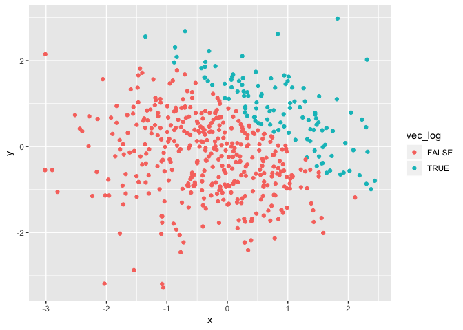
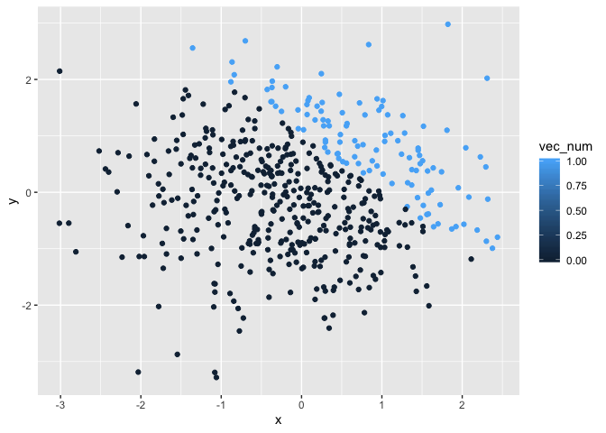
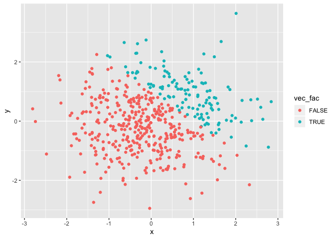

p8105\_hw1\_at3346
================
Ashley Tseng
9/20/2019

# Problem 1

## Creating dataframe and taking means of variables:

``` r
set.seed(7)

prob1_df = tibble(
  random_samp = rnorm(8),
  random_samp_zero = random_samp > 0,
  vec_char = c("red", "orange", "yellow", "green", "blue", "purple", "pink", "black"),
  vec_fac = factor(c("high", "medium", "low", "high", "medium", "low", "high", "medium"))
)

mean(prob1_df[["random_samp"]])
```

    ## [1] -0.1628599

``` r
mean(prob1_df[["random_samp_zero"]])
```

    ## [1] 0.25

``` r
mean(prob1_df[["vec_char"]])
```

    ## Warning in mean.default(prob1_df[["vec_char"]]): argument is not numeric or
    ## logical: returning NA

    ## [1] NA

``` r
mean(prob1_df[["vec_fac"]])
```

    ## Warning in mean.default(prob1_df[["vec_fac"]]): argument is not numeric or
    ## logical: returning NA

    ## [1] NA

I am able to take the mean of “random\_samp” and “random\_samp\_zero”,
but not of “vec\_char” and “vec\_fac” because the last two are
non-numeric
variables.

## Applying the “as.numeric” function to the logical, character, and factor variables:

``` r
transform(prob1_df, random_samp_zero = as.numeric(random_samp_zero))
transform(prob1_df, vec_char = as.numeric(vec_char)
transform(prob1_df, vec_fac = as.numeric(vec_fac))
```

I am able to convert “random\_samp\_zero” and “vec\_fac”, but not
“vec\_char”. The factor variable recognizes that my variable has three
different levels, hence why I am able to convert “vec\_fac” to a numeric
variable. However, R was unable to take the mean of the factor variable
when the levels were
non-numeric.

## Converting and multiplying vectors:

``` r
mult1 = as.numeric(prob1_df[["random_samp_zero"]])*(prob1_df[["random_samp"]])

mult2 = factor(prob1_df[["random_samp_zero"]])*(prob1_df[["random_samp"]])
```

    ## Warning in Ops.factor(factor(prob1_df[["random_samp_zero"]]),
    ## (prob1_df[["random_samp"]])): '*' not meaningful for factors

``` r
conv1 = factor(prob1_df[["random_samp_zero"]])
mult = as.numeric(conv1)*(prob1_df[["random_samp"]])
```

# Problem 2

``` r
set.seed(8)

prob2_df = tibble(
  x = rnorm(500),
  y = rnorm(500),
  vec_log = x + y > 1,
  vec_num = as.numeric(vec_log),
  vec_fac = as.factor(vec_log)
)

prob2_df_nrow = nrow(prob2_df)
prob2_df_ncol = ncol(prob2_df)

mean_x = mean(pull(prob2_df, x)) 
median_x = median(pull(prob2_df, x)) 
sd_x = sd(pull(prob2_df, x)) 

vec_gr1 = mean(pull(prob2_df, vec_num))
```

The number of rows in the dataset is 500. The number of columns in the
dataset is 5. The mean of x is -0.07. The median of x is -0.06. The
standard deviation of x is 1.02. The proportion of cases for which x + y
\> 1 is
0.

## Scatterplots of the logical, numeric, and factor variables:

``` r
plot1 = ggplot(prob2_df, aes(x = x, y = y, color = vec_log)) + geom_point()
plot1
```

<!-- -->

``` r
plot2 = ggplot(prob2_df, aes(x = x, y = y, color = vec_num)) + geom_point()
plot2
```

<!-- -->

``` r
plot3 = ggplot(prob2_df, aes(x = x, y = y, color = vec_fac)) + geom_point()
plot3
```

<!-- -->

``` r
ggsave("plot1.pdf")
```

    ## Saving 7 x 5 in image

On the scatterplot for the logical variable, points for which “vec\_log”
= TRUE are displayed in blue while points for which “vec\_log” = FALSE
are displayed in orange The variable is being displayed as a binary
variable.

On the scatterplot for the numeric variable, the legend is a gradient
color scale, reflecting a continuous variable. If we look more closely,
the points for which “vec\_num” = 0 are displayed in dark blue while
“vec\_num” = 1 are displayed in light blue, indicating that there are
only two different values being displayed (0 or 1).

On the scatterplot for the factor variable, points for which “vec\_fac”
= TRUE are displayed in teal while “vec\_fac” = FALSE are displayed in
orange The variable is being displayed as a binary variable. The plot
for “vec\_fac” looks identical to the plot for “vec\_log”.
